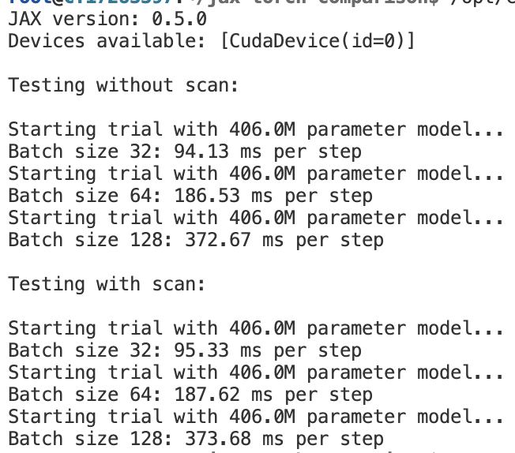
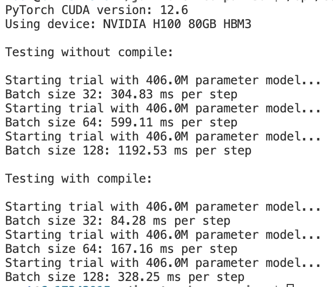

# jax-torch-comparison

Comparing JAX and PyTorch speed on GPUs using language model inference. The goal isn't to compare the absolute best model or settings, but 
more an average or naive comparison of the two frameworks (but fair by using same dtypes, precisions, etc.). Also I didn't want to 
spend too much time on the project :p

```bash
pip install -r requirements.txt && pip install -U "jax[cuda12]" && pip install --pre torch==2.7.0.dev20250110+cu126 --index-url https://download.pytorch.org/whl/nightly/cu126 --upgrade
```

## Speed Comparison

TL;DR: Torch is faster, but only after using torch.compile and enabling tensorfloat32. JAX looks to have higher max memory for this
model since it OOMs at batch size 256 but torch runs.

JAX could be faster if it becomes hard to get everything into torch.compile (I started using JAX when I wanted to be able to compile
an entire RL pipeline including environment, replaybuffer, agent, and model all under a single jit). Also, there may be cases where it is
easier to distribute using JAX, as its sharding tends to be more flexible. If you can get everything into torch.compile nicely and
have a straightforward distribution setup, it's probably better to use torch when on GPUs.

Update: Merged PR from Lucas Nestler that sets max autotune for torch compile. My original idea was to have a naive (but fair) comparison
with not too many bells and whistles, but setting max-autotune to sacrifice some compile time for better performance during training is realistic!

### JAX Implementation (1xH100 SXM 80GB):


### PyTorch Implementation (1xH100 SXM 80GB):

