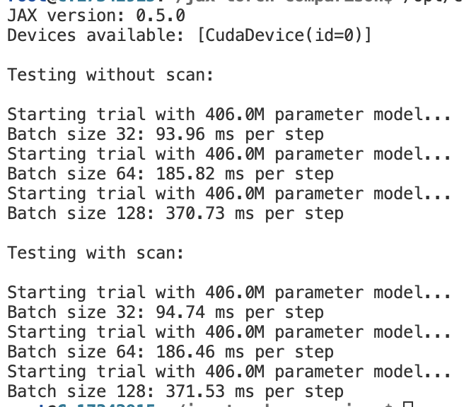

# jax-torch-comparison

Comparing JAX and PyTorch speed on GPUs using language model inference.

```bash
pip install -r requirements.txt && pip install -U "jax[cuda12]" && pip install --pre torch==2.7.0.dev20250110+cu126 --index-url https://download.pytorch.org/whl/nightly/cu126 --upgrade
```

## Speed Comparison

TL;DR: Torch is faster, but only after using torch.compile and enabling tensorfloat32. JAX looks to have higher max memory for this
model since it OOMs at batch size 256 but torch runs.

JAX could be faster if it becomes hard to get everything into torch.compile (I started using JAX when I wanted to be able to compile
an entire RL pipeline including environment, replaybuffer, agent, and model all under a single jit). Also, there may be cases where it is
easier to distribute using JAX, as its sharding tends to be more flexible. If you can get everything into torch.compile nicely and
have a straightforward distribution setup, it's probably better to use torch when on GPUs.

### JAX Implementation (1xH100 SXM 80GB):


### PyTorch Implementation (1xH100 SXM 80GB):

